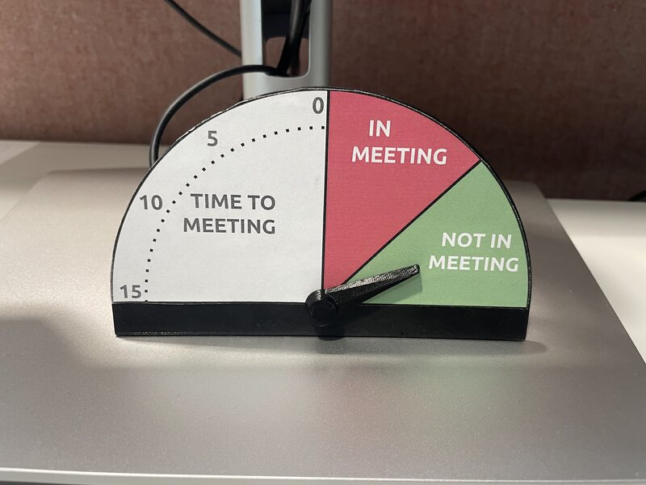

# Physical Meeting Countdown Timer



This repository contains the end-to-end software and hardware design for a
physical meeting countdown timer. The system monitors your Google Calendar,
stores upcoming meeting schedules in the cloud, and physically drives an analog
dial pointer on an ESP32 microcontroller to show meeting status and time
remaining before your next meeting.

## Project Architecture & Components

The project is structured into three main decoupled components:

### 1. Calendar Checker ([check_meetings](./check_meetings))

A Python script that authenticates with the Google Calendar API via OAuth 2.0.
It runs locally or as a cron job to inspect your primary calendar for recent
and upcoming meetings. It extracts the end time of the most recent past event
and the start time of the next upcoming event, and uploads them to the Cloud
Function webhook whenever the schedule changes.

### 2. Database Bridge ([cloud_function](./cloud_function))

A lightweight Google Cloud Function (Python 3.10) backed by Google Cloud
Datastore. It acts as a secure intermediary bridge. It receives updated meeting
timestamps via POST requests from the calendar checker and serves them as a
plain-text comma-separated string (`prev_timestamp,next_timestamp`) via GET
requests to lightweight IoT clients.

### 3. Hardware Dial Controller ([esp32](./esp32))

An Arduino sketch (`dial.ino`) running on an ESP32 microcontroller. Note that
the USB cable is used **only for power**; the ESP32 receives no schedule data
over USB, retrieving all updates wirelessly via WiFi. The device synchronizes
its clock via NTP and polls the Cloud Function every 30 seconds. Based on the
time remaining until the next meeting, it controls a servo motor to indicate:

- **Meeting in Progress**: Active meeting currently happening.
- **No Upcoming Meeting**: More than 15 minutes remaining.
- **Countdown**: Linearly interpolated dial movement from 15 to 0 minutes.

## Hardware Assembly & Fabrication

![Detail 1][det1] ![Detail 2][det2] ![Detail 3][det3]

[det1]: ./images/assembly_detail_1.jpg
[det2]: ./images/assembly_detail_2.jpg
[det3]: ./images/assembly_detail_3.jpg

### Required Hardware

- **ESP32 Microcontroller Development Board**
- **SG90 9g Micro Servo Motor**
- **170-point Mini Breadboard**

### 3D Printable Models & Dial Face

The physical enclosure and dial face design are based on the following models
and drawings:

- [Printable Front of the Dial](https://docs.google.com/drawings/d/1DnF3LDq3TVFH-bWyccoz5u9v7ACNQKjGr73q7T_4-TQ/edit?usp=sharing):
  Google Drawings template for printing the physical front face of the dial.
- [Servo Dial](https://www.thingiverse.com/thing:4049316) by Deulis: A gauge
  dial face designed to display the angular movement of a 9g micro servo.
- [Servo Pointer Needle](https://www.thingiverse.com/thing:4460407) by
  RockyMtnMark: A pointer needle designed to attach to a 9g micro servo horn.

### Wiring & Connection Diagram

You can connect the ESP32, mini breadboard, and SG90 servo motor as follows:

```text
  +-------------------+              +------------------------+
  |    ESP32 Board    |              |    SG90 Servo Motor    |
  | [GND]  [5V] [P21] |              | [Brown] [Red] [Orange] |
  +---+-----+----+----+              +---+------+--------+----+
      |     |    |                       |      |        |
      |     |    |                       |      |        |
      +-----|----|-----------------------+      |        |
            +----|------------------------------+        |
                 +---------------------------------------+
          (All connections routed via 170-pt breadboard)
```

| ESP32 Pin | Breadboard Rail | Servo Wire | Function |
| :--- | :--- | :--- | :--- |
| `GND` | `(-) Ground Rail` | `Brown` | Common Ground |
| `VIN / 5V` | `(+) Positive Rail` | `Red` | Servo Power (VCC) |
| `GPIO 21` | `Signal Row` | `Orange` | PWM Signal Control |

## Getting Started

To deploy the complete end-to-end meeting timer system, follow the setup guides
in each component directory in order:

1. **Deploy the Cloud Function**: Follow the instructions in
   [cloud_function/README.md](./cloud_function/README.md) to set up Datastore
   and deploy the public webhook endpoint.
1. **Configure Calendar Polling**: Follow the instructions in
   [check_meetings/README.md](./check_meetings/README.md) to obtain Google API
   credentials, perform initial OAuth login, and configure automated cron
   polling.
1. **Flash the ESP32**: Follow the instructions in
   [esp32/README.md](./esp32/README.md) to update your WiFi credentials, Cloud
   Function URL, and servo calibration angles before uploading to the ESP32.

## Frequently Asked Questions

For answers regarding architecture design, security, hardware compatibility,
and calibration, please see the [FAQ](./FAQ.md).

## Demonstration Video

Watch the physical dial pointer in action:

https://github.com/user-attachments/assets/62628b0f-6fa1-45ba-abe8-b6107609d335
